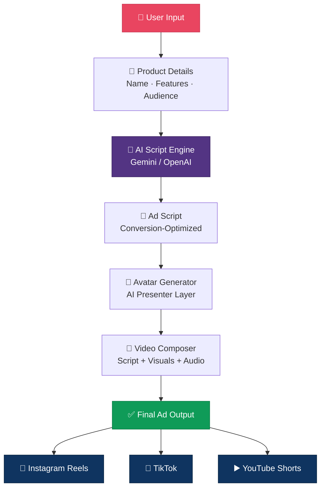

```
██╗   ██╗ ██████╗  ██████╗      █████╗ ██████╗     ███████╗██╗   ██╗███████╗██╗ ██████╗ ███╗   ██╗
██║   ██║██╔════╝ ██╔════╝     ██╔══██╗██╔══██╗    ██╔════╝██║   ██║██╔════╝██║██╔═══██╗████╗  ██║
██║   ██║██║  ███╗██║          ███████║██║  ██║    █████╗  ██║   ██║███████╗██║██║   ██║██╔██╗ ██║
██║   ██║██║   ██║██║          ██╔══██║██║  ██║    ██╔══╝  ██║   ██║╚════██║██║██║   ██║██║╚██╗██║
╚██████╔╝╚██████╔╝╚██████╗     ██║  ██║██████╔╝    ██║     ╚██████╔╝███████║██║╚██████╔╝██║ ╚████║
 ╚═════╝  ╚═════╝  ╚═════╝     ╚═╝  ╚═╝╚═════╝     ╚═╝      ╚═════╝ ╚══════╝╚═╝ ╚═════╝ ╚═╝  ╚═══╝
```

### 🎬 AI-Powered Advertisement Video Generator

> *UGC Ad Fusion harnesses cutting-edge AI to auto-generate authentic, influencer-style video ads — eliminating expensive production teams, manual editing, and slow creative cycles for modern marketers.*

**Transform any product into a scroll-stopping, high-converting UGC-style video ad — in minutes.**

[](https://nodejs.org/)
[](https://reactjs.org/)
[](https://tailwindcss.com/)
[](https://expressjs.com/)
[](https://ai.google.dev/)
[](https://openai.com/)
[](https://vercel.com/)


[](https://github.com/ShubhamNegi-07/UGC-Ad-Fusion-AI-powered-Advertisement-Video-Generator)
[](https://github.com/ShubhamNegi-07/UGC-Ad-Fusion-AI-powered-Advertisement-Video-Generator)
[](https://opensource.org/licenses/MIT)


*UGC Ad Fusion harnesses cutting-edge AI to auto-generate authentic, influencer-style video ads — eliminating expensive production teams, manual editing, and slow creative cycles for modern marketers.*


> 📽️ *Demo GIF / hosted video coming soon — check back or contribute one!*

</div>

---

## 📌 Table of Contents

- [What is UGC Ad Fusion?](#-what-is-ugc-ad-fusion)
- [Why This Exists](#-why-this-exists)
- [How It Works](#-how-it-works)
- [Key Features](#-key-features)
- [Tech Stack](#-tech-stack)
- [System Architecture](#-system-architecture)
- [Getting Started](#-getting-started)
- [Use Cases](#-use-cases)
- [Roadmap](#-roadmap)
- [Author](#-author)
- [Contributing](#-contributing)

---

## 🚀 What is UGC Ad Fusion?

**UGC Ad Fusion** is a full-stack, AI-driven platform that **automates the creation of UGC-style advertisement videos**.

No hiring creators. No manual scripting. No editing bottlenecks.

Just provide your product details — and the AI pipeline takes over: writing scripts, rendering avatars, and composing a ready-to-publish video ad optimized for **Instagram Reels**, **TikTok**, and **YouTube Shorts**.

```
Product: "Skincare Serum with Vitamin C"
         ↓
 AI Script Generated
         ↓
 Avatar Narration Rendered
         ↓
 ✅ Final Video Ad — Ready to Publish
```

---

## 💡 Why This Exists

| Traditional Ad Creation | ⚡ UGC Ad Fusion |
|---|---|
| 🕐 Days to weeks of production time | ✅ Minutes from input to output |
| 💸 High cost per video | ✅ Dramatically lower production cost |
| 🔁 Manual iteration cycles | ✅ Instant multi-variation generation |
| 👥 Requires a team (creator, editor, strategist) | ✅ One person. One prompt. |
| 📉 Hard to scale content output | ✅ Built for scalable marketing pipelines |

---

## 🧠 How It Works

UGC Ad Fusion runs a structured AI pipeline from your input to a finished video:

```
┌─────────────────────────────────────────────────────────────────┐
│                                                                 │
│   📝 User Input  ──►  🤖 Script Engine  ──►  🧍 Avatar Gen     │
│                                                    │            │
│                   🎬 Final Ad Output  ◄──  🎥 Video Composer   │
│                                                                 │
└─────────────────────────────────────────────────────────────────┘
```

### Step-by-Step Breakdown

| Step | Module | What Happens |
|------|--------|--------------|
| 1️⃣ | **Product Input** | User provides product name, features, and target audience |
| 2️⃣ | **AI Script Engine** | Generates conversion-focused, platform-optimized ad scripts |
| 3️⃣ | **Avatar Selection** | AI selects or renders a realistic human-like presenter |
| 4️⃣ | **Video Composition** | Combines narration + visuals into a cohesive UGC-style ad |
| 5️⃣ | **Output Delivery** | Returns a final video ready for social media upload |

---

## ✨ Key Features

| Feature | Description |
|---------|-------------|
| 🎬 **UGC-Style Video Generation** | Produces authentic, creator-style video ads automatically |
| 🧠 **Intelligent Script Generation** | Context-aware scripts tuned for conversions |
| 🧍 **Realistic AI Avatars** | Human-like influencer-style presentation layer |
| ⚡ **Fast Rendering Pipeline** | High-speed output for rapid content deployment |
| 🔁 **Multiple Ad Variations** | Generate A/B test variants with a single product input |
| 📱 **Social-First Design** | Optimized for Reels, TikTok, and Shorts formats |
| 🌐 **Scalable Architecture** | Built to support large-scale marketing campaigns |

---

## 🏗️ Tech Stack

<div align="left">

**🖥️ FRONTEND**

[](https://reactjs.org/)
[](https://tailwindcss.com/)

**⚙️ BACKEND**

[](https://nodejs.org/)
[](https://expressjs.com/)

**🤖 AI & INTEGRATIONS**

[](https://ai.google.dev/)
[](https://openai.com/)

**🗄️ DATABASE & STORAGE**

[](https://neon.tech/)
[](https://cloudinary.com/)

**🔐 AUTH & MONITORING**

[](https://clerk.com/)
[](https://sentry.io/)

**🚀 DEPLOYMENT**

[](https://vercel.com/)
[](https://render.com/)

</div>

---

## ⚙️ System Architecture



---

## 📦 Getting Started

### Prerequisites

Make sure you have the following installed:

- **Node.js** v18+
- **npm** or **yarn**
- API keys for **Gemini / OpenAI** and your **video generation service**

### Installation

```bash
# 1. Clone the repository
git clone https://github.com/ShubhamNegi-07/UGC-Ad-Fusion-AI-powered-Advertisement-Video-Generator.git

# 2. Navigate into the project
cd UGC-Ad-Fusion-AI-powered-Advertisement-Video-Generator

# 3. Install dependencies
npm install
```

### Configuration

Create a `.env` file in the root directory:

```env
DATABASE_URL=your_database_url_here
CLERK_PUBLISHABLE_KEY=your_clerk_publishable_key_here
CLERK_SECRET_KEY=your_clerk_secret_key_here
CLOUDINARY_URL=your_cloudinary_url_here
PORT=3000
```

### Run

```bash
# Development
npm run dev

# Production
npm run build && npm start
```

> 🌐 App will be running at `http://localhost:3000`

---

## 📌 Use Cases

| Industry | Use Case |
|----------|----------|
| 🛍️ **E-commerce** | Product launch ads, seasonal promotions |
| 🚀 **Startups** | Rapid MVP marketing without a production team |
| 📱 **Social Media Agencies** | Scale content output for multiple clients |
| 🎯 **Performance Marketers** | Fast A/B testing of ad creatives |
| 🎥 **Content Creators** | Automate branded content production |

---

## 🔮 Roadmap

- [x] Core AI script generation pipeline
- [x] Avatar narration integration
- [x] UGC-style video output
- [ ] 🎙️ AI voice cloning for personalized narration
- [ ] 🎭 Custom avatar generation from uploaded photos
- [ ] 📊 Performance analytics dashboard
- [ ] 📱 Mobile-first responsive experience
- [ ] 🎯 AI-driven ad performance optimization
- [ ] 🌍 Multi-language ad generation

---

## 👨‍💻 Author

<div align="center">

**SHUBHAM NEGI**

[](https://github.com/ShubhamNegi-07)
[](https://www.linkedin.com/in/shubham-singh11/)

</div>

---

## 🤝 Contributing

Contributions are welcome and appreciated!

```bash
# 1. Fork the repository
# 2. Create your feature branch
git checkout -b feature/AmazingFeature

# 3. Commit your changes
git commit -m 'Add AmazingFeature'

# 4. Push to your branch
git push origin feature/AmazingFeature

# 5. Open a Pull Request
```

Please open an [Issue](https://github.com/ShubhamNegi-07/UGC-Ad-Fusion-AI-powered-Advertisement-Video-Generator/issues) to discuss any major changes first.

---

## ⭐ Support the Project

If UGC Ad Fusion helped or inspired you:

- ⭐ **Star** this repository
- 🍴 **Fork** and build on top of it
- 📣 **Share** it with someone who needs it
- 🐛 **Report bugs** or suggest features via [Issues](https://github.com/ShubhamNegi-07/UGC-Ad-Fusion-AI-powered-Advertisement-Video-Generator/issues)

---

<div align="center">

**UGC Ad Fusion** — making high-quality ad creation instant, scalable, and accessible to everyone.

*Built with ❤️ by [Shubham Negi](https://github.com/ShubhamNegi-07)*

</div>